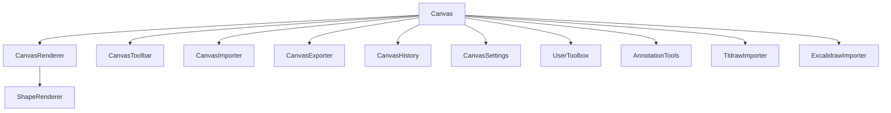

# Project Architecture Baseline

Project UUID: 45977b8f-64c1-4b09-94e6-6d5416521aa1

This diagram captures the state of the codebase before implementing drag-and-drop functionality for toolboxes and canvas elements.
