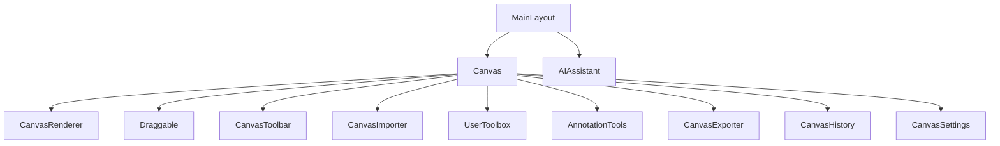

# Project Architecture Baseline

Project UUID: 45977b8f-64c1-4b09-94e6-6d5416521aa1

```mermaid
graph TD
  MainLayout --> Canvas
  MainLayout --> AIAssistant
  Canvas --> CanvasRenderer
  Canvas --> Draggable
  Canvas --> CanvasToolbar
  Canvas --> CanvasImporter
  Canvas --> UserToolbox
  Canvas --> AnnotationTools
  Canvas --> CanvasExporter
  Canvas --> CanvasHistory
  Canvas --> CanvasSettings
```

This diagram captures the state of the codebase before introducing LLM connectivity for the AI assistant.
