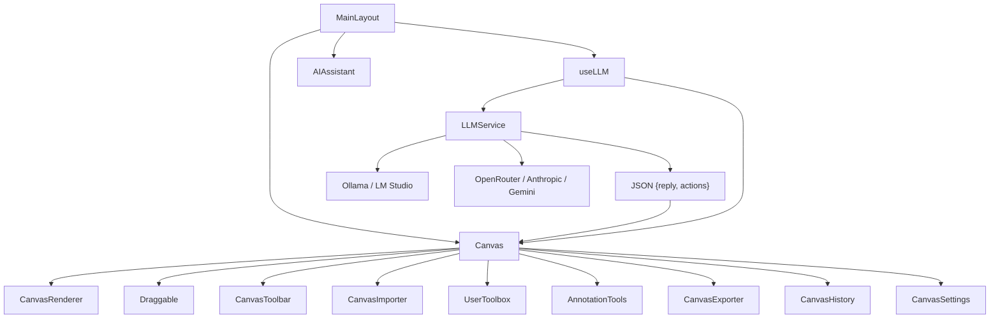

# Project Architecture Updated

Project UUID: 45977b8f-64c1-4b09-94e6-6d5416521aa1

This diagram reflects the codebase after integrating LLM connectivity for the AI assistant, where the provider-agnostic service returns JSON containing a user-facing reply and CanvasAction[] used to create drag-and-droppable elements.
